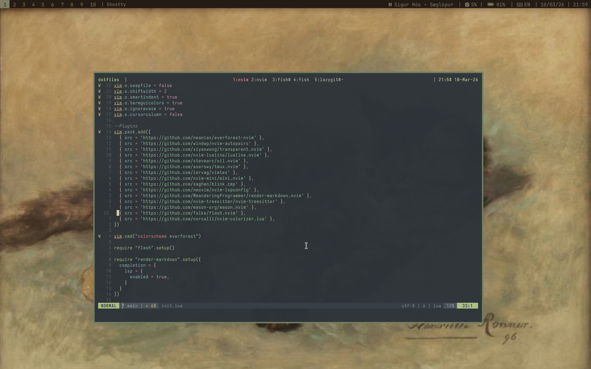
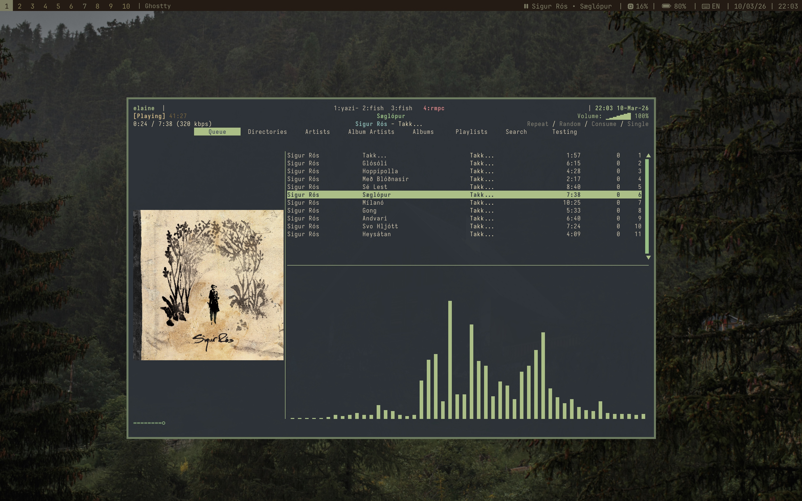
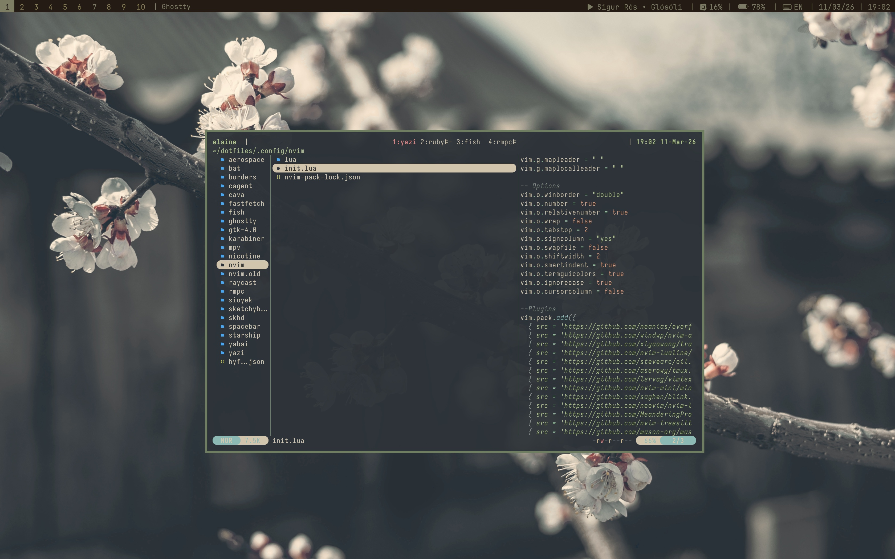
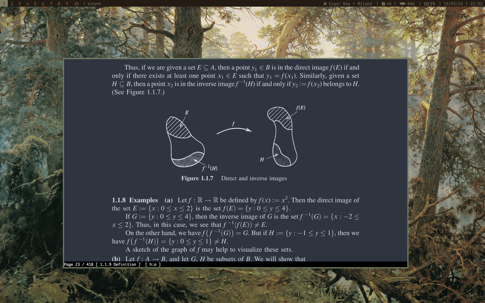

# MacOS dotfiles that works for me

## Image Showcase 





## How to install

### Clone the repository by
```
$ git clone https://github.com/NerdyElaine/dotfiles
$ cd dotfiles
```

### Install Homebrew and Brewfile
```
$ /bin/bash -c "$(curl -fsSL https://raw.githubusercontent.com/Homebrew/install/HEAD/install.sh)"
$ Brew bundle -v Brewfile 
```

### Stow the dotfiles
```
$ stow .
```

### Change shell to fish
```
$ echo (which fish) | sudo tee -a /etc/shells
$ chsh -s (which fish)
```

### Dependencies 

[aspauldingcode/Apple-Sharpener](https://github.com/aspauldingcode/apple-sharpener)

[CoreBedtime/Ammonia](https://github.com/CoreBedtime/ammonia)

Disable csrutils
Boot into start-up options
```
$ csrutil disable
```

Reboot 
```
$ sudo nvram boot-args=-arm64e_preview_abi
```


